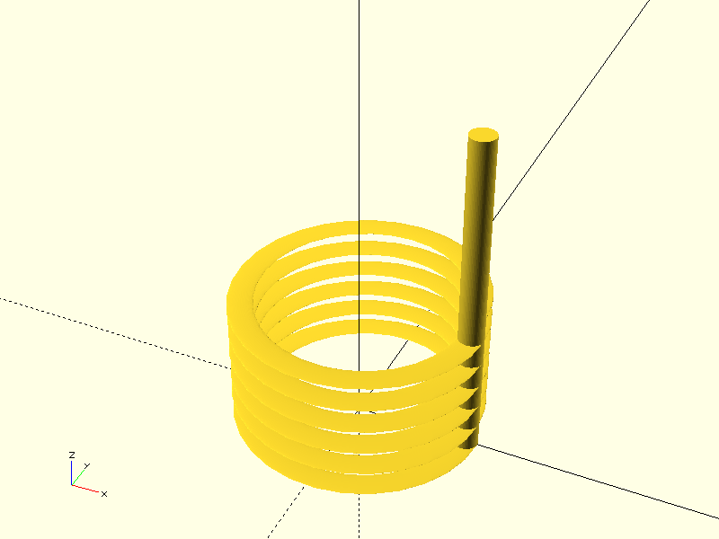
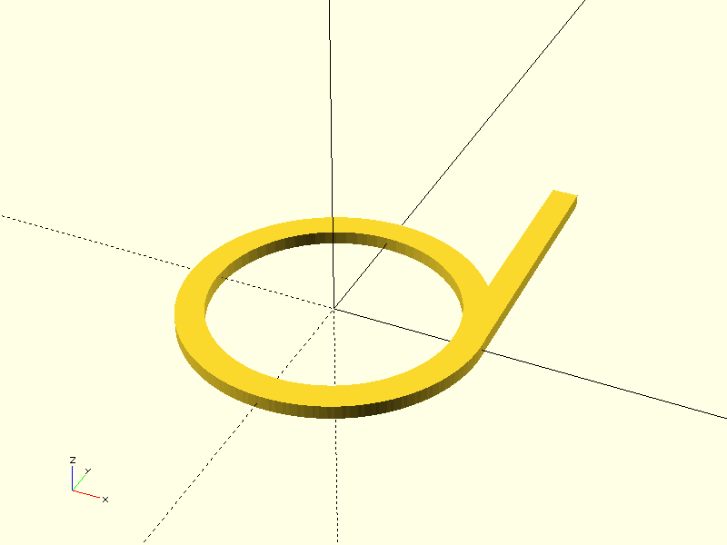

# Project CADGen

## Objective
Experiment Details :
> This aims to generate a Helical Torsion Spring.

---

## Prompts
List the prompts or inputs used are:
1. "Generate a helical torsion spring with a coil diameter of 20 mm, wire diameter of 2 mm, 6 active coils, and two straight legs extending 15 mm each at 90° angles from the ends of the coil. Model the spring as a helical path using rotate_extrude or a custom helix function. The geometry should represent a standard torsion spring with cylindrical coils."
2. "Generate a helical torsion spring using a true helical sweep with a rectangular wire cross-section. The spring must have a 20 mm coil  diameter, a 2.0 mm × 1.5 mm rectangular wire section, 6 active coils, and a coil pitch approximately equal to the wire thickness  about 2 mm. Create the coil using a library or function that supports sweeping a 2D profile along a 3D helical path, such as the BOSL2 path_sweep combined with helix_spiral(), or an equivalent custom helix-sweep function. The two straight legs must each be 20 mm long, extending tangentially from the start and end of the helix, following the tangent direction of the spring so they do not cut through or intersect the coil, while keeping the rectangular cross-section correctly aligned with the helix orientation. The final geometry should be manifold, printable, and accurately represent a standard torsion spring with a non-circular wire profile."
3. "Generate a torsion spring using a custom helical sweep implemented directly in OpenSCAD without external libraries. The spring must have a coil diameter of 20 mm, a rectangular wire cross-section of 2.0 mm × 1.5 mm, 6 active coils, and a pitch of approximately 2 mm. Create the geometry by computing a parametric helix and sweeping the rectangular profile along the helix using small incremental rotations and translations, forming a segmented but continuous coil. The two straight legs should be 20 mm long each and extend tangentially from the start and end of the helix, aligned to the helix tangent so they do not intersect the coils. The rectangular cross-section must remain properly oriented as the sweep turns around the helix. All geometry must be fully manifold and printable and must not rely on external OpenSCAD libraries."

---

## Result

| Prompt | Time Taken | Attempt | Outcome | Error |
|--------|------------|--------|---------|-------|
| Prompt 1 | 40.28s | 1 |  | Partial Success |
| Prompt 2 | 48.9s | 2 |  | Failure - Can't open library 'BOSL2/BOSL2.scad' |
| Prompt 3 | 54.8s | 3 |  | Failure |

---

### Notes
- **Time Taken**: Duration it took to complete the task.
- **Attempt**: Number of attempts made for that prompt.
- **Outcome**: Screenshot or visualization of the output.
- **Error**: Any error messages encountered during execution.

---

## Command
python3 main.py -ri -p "Prompt" -d "directory" -b "basename"
