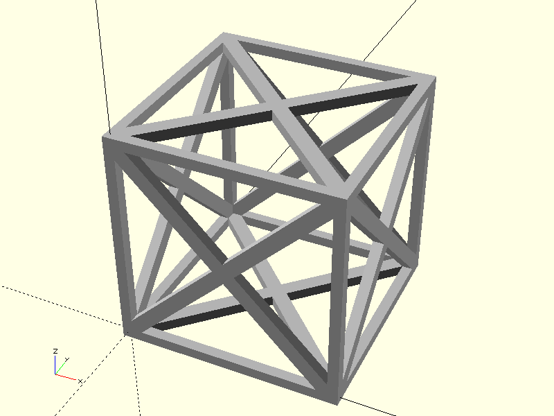
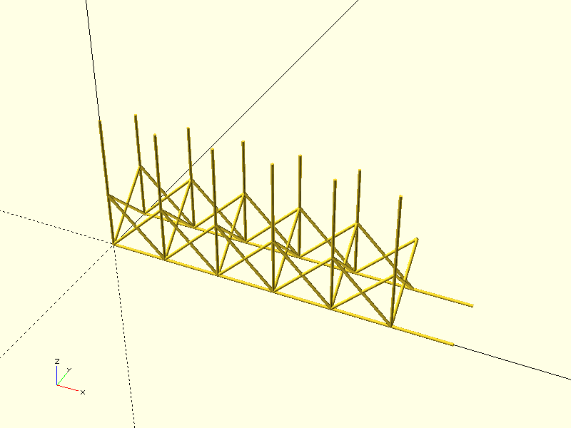
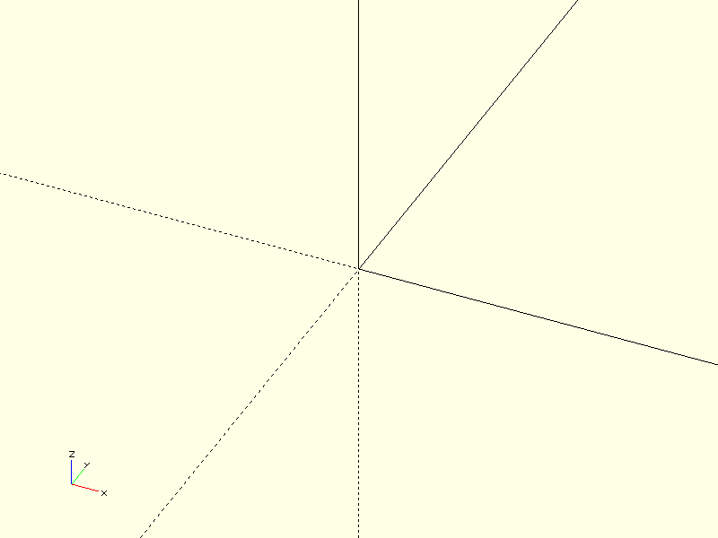
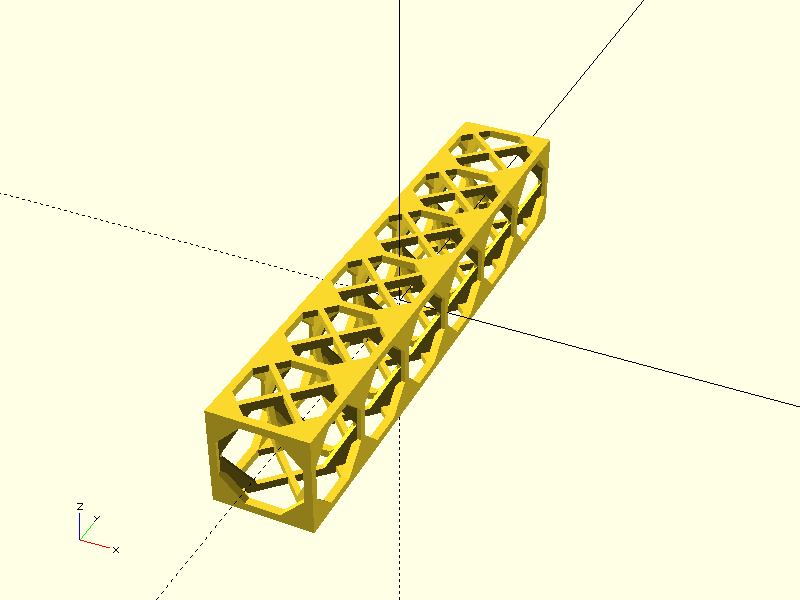

# Project CADGen

## Objective
Experiment Details :
> This aims to generate a truss structure.

---

## Prompts
List the prompts or inputs used are:
1. "Generate a cube truss assume dimensions yourself."
2. "Generate a cube truss with 100 mm and 5 extent in horizontal direction."
3. "Generate a cube truss with BOSL2 library with 5 extents in horizontal."
4. "Generate a cube truss with BOSL2 library and import it using include <BOSL2/std.scad> , include <BOSL2/cubetruss.scad>"
---

## Result

| Prompt | Time Taken | Attempt | Outcome | Error |
|--------|------------|--------|---------|-------|
| Prompt 1 | 22.5s | 1 |  | success |
| Prompt 2 | 39.0s | 2 |  | success - but extend bars |
| Prompt 3 | 8.7s | 3 |  | failure - incorrect lib import |
| Prompt 4 | 10.6s | 4 |  | success |

---

### Notes
- **Time Taken**: Duration it took to complete the task.
- **Attempt**: Number of attempts made for that prompt.
- **Outcome**: Screenshot or visualization of the output.
- **Error**: Any error messages encountered during execution.

---

## Command
python3 main.py -ri -p "Prompt" -d "directory" -b "basename"
