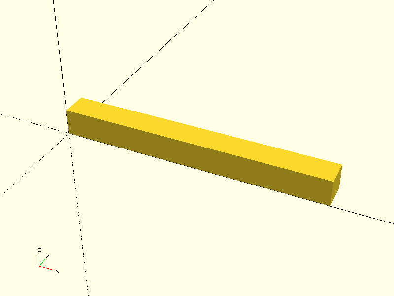
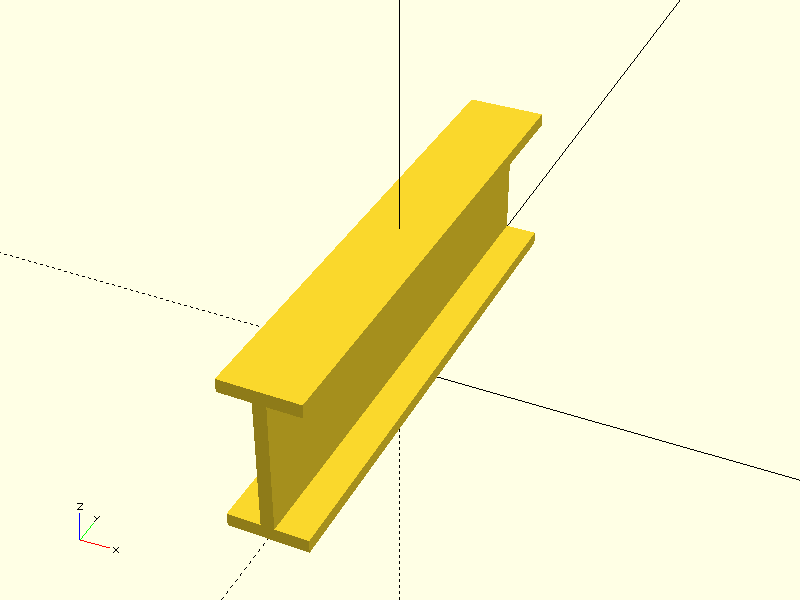
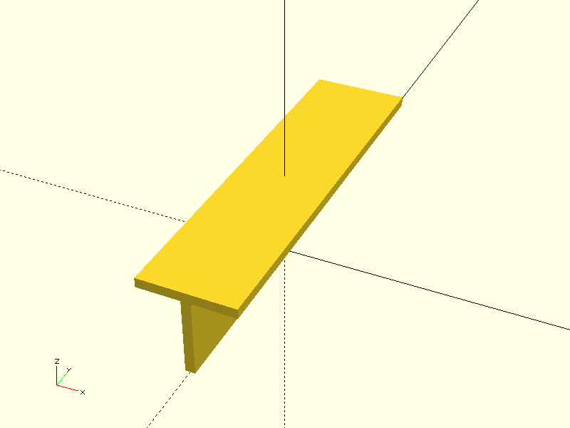
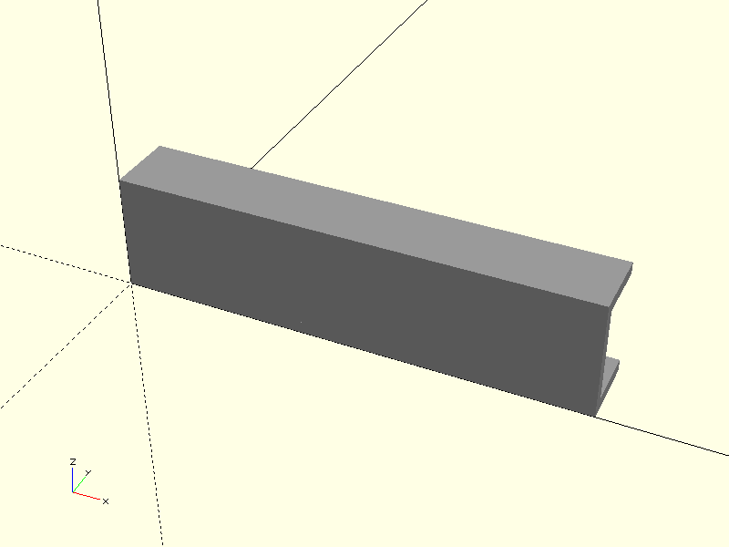
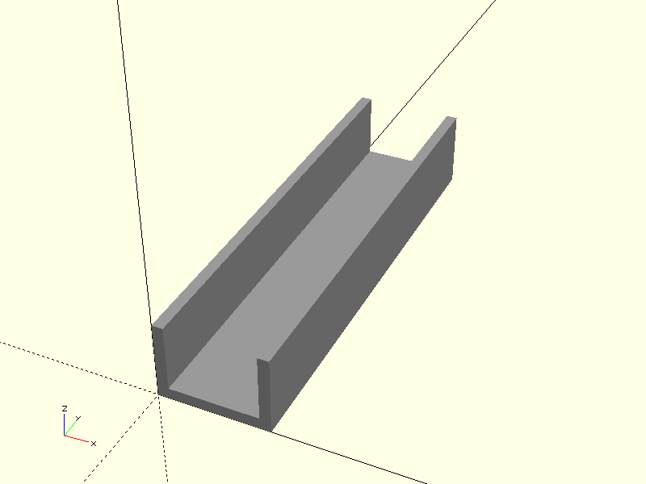

# Project CADGen

## Objective
Experiment Details :
> This aims to various types of beam.

---

## Prompts
List the prompts or inputs used are:
1. "Generate a Beam length 200."
2. "Generate a I section Beam length 200."
3. "Generate a T section Beam length 200"
4. "Generate a channel section Beam length 200. with suitable color"
5. "Generate a channel section Beam length 200 with suitable color lying flat on ground."
---

## Result

| Prompt | Time Taken | Attempt | Outcome | Error |
|--------|------------|--------|---------|-------|
| Prompt 1 | 5.4s | 1 |  | success  |
| Prompt 2 | 7.8s | 2 |  | success |
| Prompt 3 | 9.8s | 3 |  | success |
| Prompt 4 | 10.6s | 4 |  | success |
| Prompt 5 | 20.6s | 5 |  | success |

---

### Notes
- **Time Taken**: Duration it took to complete the task.
- **Attempt**: Number of attempts made for that prompt.
- **Outcome**: Screenshot or visualization of the output.
- **Error**: Any error messages encountered during execution.

---

### Additional 
# Comparison of Steel Beam Sections

| Section Type | Shape           | Strength                   | Common Uses                  |
|--------------|----------------|---------------------------|------------------------------|
| I-Beam       | “I” shape       | Good for bending          | Buildings, bridges           |
| H-Beam       | “H” shape       | Stronger, heavier         | High-rise, heavy structures  |
| T-Beam       | “T” shape       | Efficient in one direction| Floors, roofs                |
| Channel      | “C” shape       | Light and economical      | Trusses, frames              |

## Command
python3 main.py -ri -p "Prompt" -d "directory" -b "basename"
