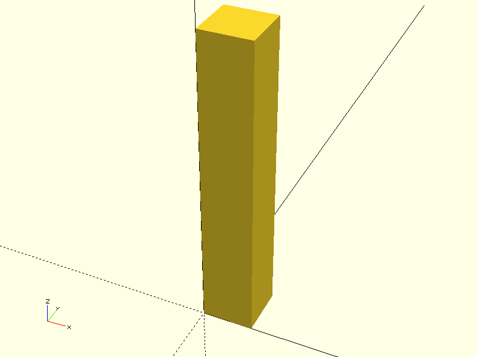

# Project CADGen

## Objective
Experiment Details :
> This project aims to Feather Key.

---

## Prompts
List the prompts or inputs used are:
1. "Generate a 3D model of a Feather Key, size 6 × 6 × 36 mm (width 6 mm, height 6 mm, length 36 mm), according to standard key dimensions."

---

## Result

| Prompt | Time Taken | Attempt | Outcome | Error |
|--------|------------|--------|---------|-------|
| Prompt 1 | 5.88s | 1 |  | None |

---

### Notes
- **Time Taken**: Duration it took to complete the task.
- **Attempt**: Number of attempts made for that prompt.
- **Outcome**: Screenshot or visualization of the output.
- **Error**: Any error messages encountered during execution.

---

## Command
python3 main.py -ri -p "Prompt" -d "directory" -b "basename"
