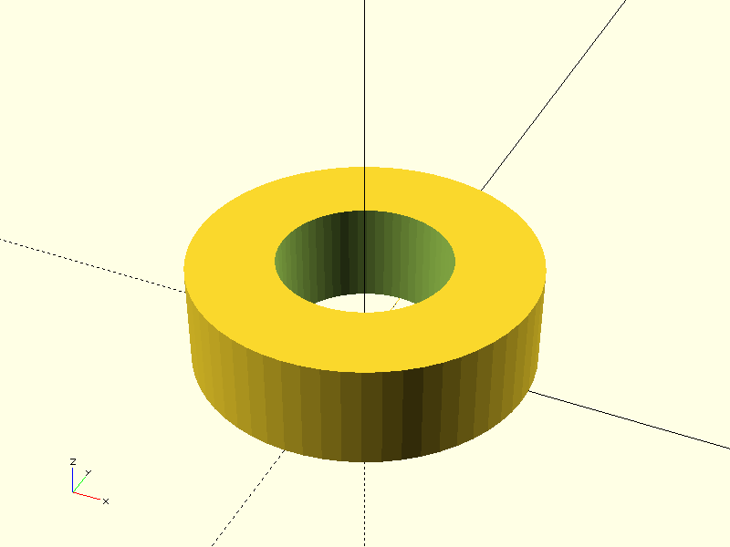
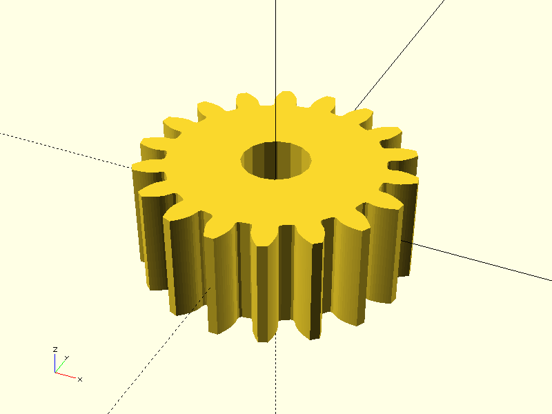

# Project CADGen

## Objective
Experiment Details :
> This aims to a spur gear with pitch radius of 9 mm and number of teeth 18.

---

## Prompts
List the prompts or inputs used are:
1. "Generate a spur gear with pitch radius 9mm."
2. "Generate a spur gear with pitch radius 9mm.You can external BOSL2 library but cross-check the syntax."
3. "Generate a spur gear with pitch radius 9mm.You can external BOSL2 library and do not use 'module' as variale as it a reserved keyword in openscad. Recheck the code after writing again."
4. "Generate a spur gear with pitch radius 9mm. Use external BOSL2 library.'Example: include <BOSL2/std.scad>
include <BOSL2/gears.scad>
spur_gear(circ_pitch=5, teeth=20, thickness=8, shaft_diam=5);'"
5. "Generate a spur gear with pitch radius 9mm. Use external BOSL2 library.
 
'Example:
include <BOSL2/std.scad>
include <BOSL2/gears.scad>
spur_gear(circ_pitch=5, teeth=20, thickness=8, shaft_diam=5);' 
 
Usage: As a Module
    spur_gear(circ_pitch, teeth, [thickness], [helical=], [pressure_angle=], [profile_shift=], [backlash=], [shaft_diam=], [hide=], [clearance=], [slices=], [internal=], [herringbone=]) [ATTACHMENTS];
    spur_gear(mod=|diam_pitch=, teeth=, [thickness=]) [ATTACHMENTS];
 
Usage: As a Function
    vnf = spur_gear(circ_pitch, teeth, [thickness]);
    vnf = spur_gear(mod=|diam_pitch=, teeth=, [thickness=]);"
6. "Generate a complete, self-contained OpenSCAD script for a single involute spur gear. The gears design must be defined by the following standard parameters:
    - **Pitch Diameter (D):** 18 mm (ensuring the Pitch Radius is 9 mm).
    - **Module (m):** 1.0 mm (This is the ratio D/Z and is standard).
    - **Number of Teeth (Z):** Must be calculated based on the Pitch Diameter and Module (Z = D/m).
    - **Pressure Angle:** Use the industry standard of 20 degrees.
    - **Thickness (H):** 5 mm.
    - **Bore Diameter:** A center hole of 4 mm.  
The OpenSCAD code should define a main gear() module and use a difference() operation to cut the center bore. Do not rely on external include <library.scad>files; define the necessary calculations and 3D geometry directly."
---

## Result

| Prompt | Time Taken | Attempt | Outcome | Error |
|--------|------------|--------|---------|-------|
| Prompt 1 | 1m 12.2s | 1 |  | Partial failure |
| Prompt 2 | 8.86s | 2 | None | failure |
| Prompt 3 | 3m 56.9s | 3 |  | failure |
| Prompt 4 | 9.24s | 4 | None | failure - 'module' syntax error - modified sys prompt  | 
| Prompt 5 | 8.8s | 5 |   | Success| 
| Prompt AI | 1.8s | 6 | None | failure |

---

### Notes
- **Time Taken**: Duration it took to complete the task.
- **Attempt**: Number of attempts made for that prompt.
- **Outcome**: Screenshot or visualization of the output.
- **Error**: Any error messages encountered during execution.

---
### Addtional Notes - **Common Gear Calculations:**
- **Module (m):** m = Pitch Circle Diameter (PCD) / Number of Teeth (N)
- **Pitch Circle Diameter (PCD):** PCD = m × N
- **Circular Pitch (p):** p = π × m
- **Addendum (a):** a = m
- **Dedendum (d):** d = 1.25 × m
- **Tooth Thickness (t):** t = π × m / 2
- **Base Circle Diameter (Db):** Db = PCD × cos(pressure_angle)
- **Whole Depth (h):** h = a + d
- **Outside Diameter (OD):** OD = PCD + 2 × a
- **Root Diameter (RD):** RD = PCD - 2 × d
- **Pressure Angle (α):** α (standard 20°)
- **Helix Angle (β):** β (for helical gears)
- **Center Distance (a):** a = (N1 + N2) / 2 × m (for meshing gears)
- **Gear Ratio (i):** i = N2 / N1
- **Circular Tooth Thickness (s):** s = π × m / 2

---

## Command
python3 main.py -ri -p "Prompt" -d "directory" -b "basename"
