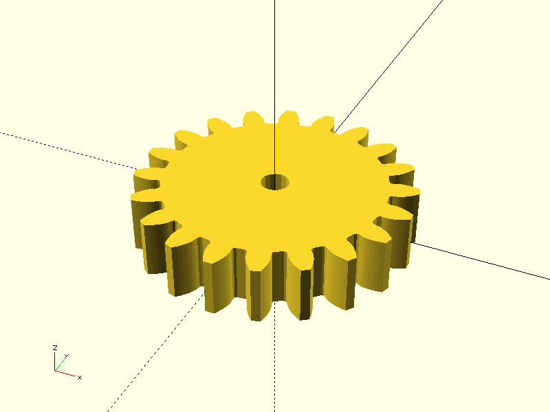
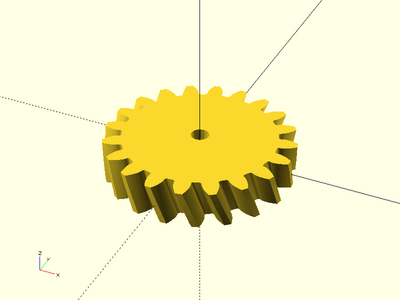

# Project CADGen

## Objective
Experiment Details :
> This aims to helical gear with pitch radius 7mm.

---

## Prompts
List the prompts or inputs used are:
1. "Generate a helical gear with pitch radius 7mm."
2. "Generate an OpenSCAD gear using the BOSL2 library. The pitch of gear should be 7mm and teeth 14."
3. "Generate an OpenSCAD gear using the BOSL2 library. The pitch of gear should be 7mm. Here is an example: 'include <BOSL2/std.scad>
include <BOSL2/gears.scad>
spur_gear(
    circ_pitch=5, teeth=20, thickness=10,
    shaft_diam=5, helical=-30, slices=12,
    $fa=1, $fs=1
);'"
4. "Generate an OpenSCAD gear using the BOSL2 library. The pitch of gear should be 7mm and helix angle 20 degree. Here is an example: 'include <BOSL2/std.scad>
include <BOSL2/gears.scad>
spur_gear(
    circ_pitch=5, teeth=20, thickness=10,
    shaft_diam=5, helical=-30, slices=12,
    $fa=1, $fs=1
);"

---

## Result

| Prompt | Time Taken | Attempt | Outcome | Error |
|--------|------------|--------|---------|-------|
| Prompt 1 | 59.67s | 1 | None | failure - syntax and login error |
| Prompt 2 | 6.8s | 2 |  | partial success - syntax error (wrong lib include and name of module is wrong) |
| Prompt 3 | 7.6s| 3 |  | partial success - no helix angle of teeth |
| Prompt 4 | 9.78s | 4 |  | success |
---

### Notes
- **Time Taken**: Duration it took to complete the task.
- **Attempt**: Number of attempts made for that prompt.
- **Outcome**: Screenshot or visualization of the output.
- **Error**: Any error messages encountered during execution.

---

### Additional Notes
- **$fn** – Minimum number of segments used to approximate a full 360° circle.
- **$fs** – Minimum fragment (edge) length in millimeters for tessellating curves.
- **$fa** – Maximum angle in degrees that any curve segment is allowed to span.

- **Spur gear module:** m = d / z
- **Helical normal module:** mn = p_n / π
- **Helical transverse module:** mt = mn / cos(β)
- **Spur pitch diameter:** d = m · z
- **Helical pitch diameter:** d = mt · z
- **Helical transverse circular pitch:** p_t = π · mt
- **Helical normal circular pitch:** p_n = π · mn
- **Helical tooth relation:** p_t = p_n / cos(β)
- **Helical base circle:** d_b = d · cos(φ_t)
- **Spur base circle:** d_b = d · cos(φ)
- **Helical transverse pressure angle:** tan(φ_t) = tan(φ_n) / cos(β)
- **Helical addendum:** a = mn
- **Helical dedendum:** b = 1.25 · mn

## Command
python3 main.py -ri -p "Prompt" -d "directory" -b "basename"
