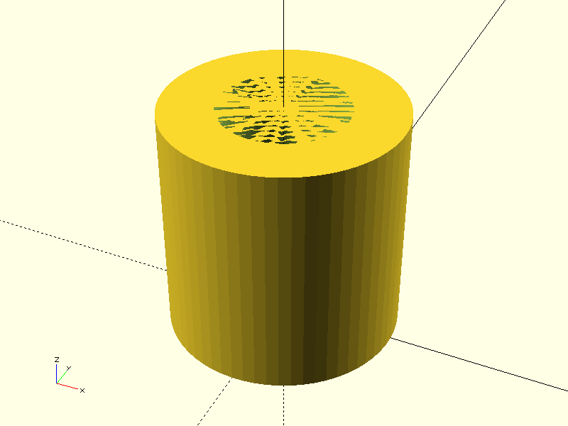
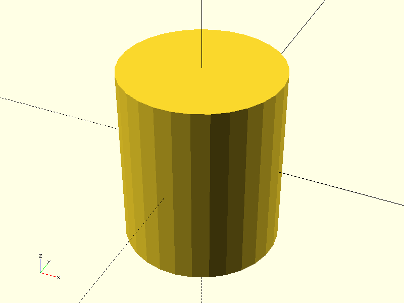
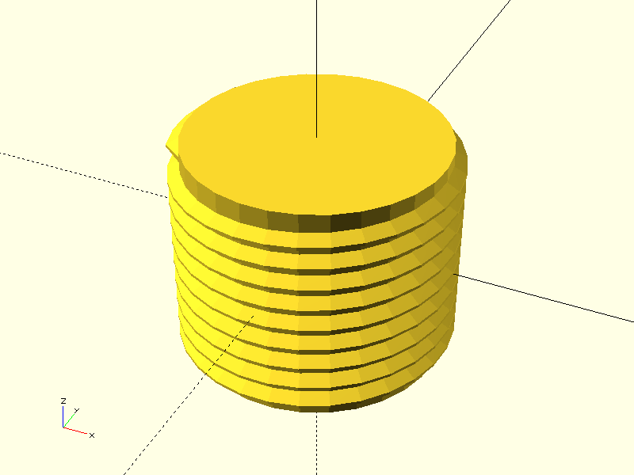

# Project CADGen

## Objective
Experiment Details :
> This aims to generate threads.

---

## Prompts
List the prompts or inputs used are:
1. "Generate a standard thread for nut."
2. "Generate a standard thread for nut. Use BOSL2 library and import it using include <BOSL2/s
td.scad> , include <BOSL2/cubetruss.scad>"
3. "Generate a standard thread for nut. Use BOSL2 library and import it using include <BOSL2/std.scad> , include <BOSL2/cubetruss.scad> 'example: include <BOSL2/std.scad>
include <BOSL2/threading.scad>
threaded_rod(d=25, l=20, pitch=2, $fa=1, $fs=1, end_len=1.5, bevel=true);'"
4. "Generate a standard thread assume diemensions. Use BOSL2 library 'example:include <BOSL2/std.scad>               
include <BOSL2/threading.scad>
threaded_rod(d=25, height=20, pitch=2, $fa=1, $fs=1);'"
---

## Result

| Prompt | Time Taken | Attempt | Outcome | Error |
|--------|------------|--------|---------|-------|
| Prompt 1 | 38.6s | 1 |  | None |
| Prompt 2 | 9.48s | 2 |  | failure -Incorrect syntax |
| Prompt 3 | 15.2s | 3 |  | failure |
| Prompt 3 | 8.7s | 4 |  | success |

---

### Notes
- **Time Taken**: Duration it took to complete the task.
- **Attempt**: Number of attempts made for that prompt.
- **Outcome**: Screenshot or visualization of the output.
- **Error**: Any error messages encountered during execution.

---

## Command
python3 main.py -ri -p "Prompt" -d "directory" -b "basename"
