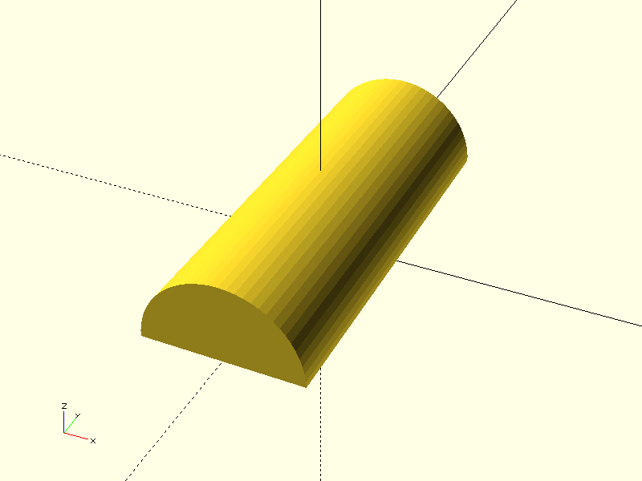
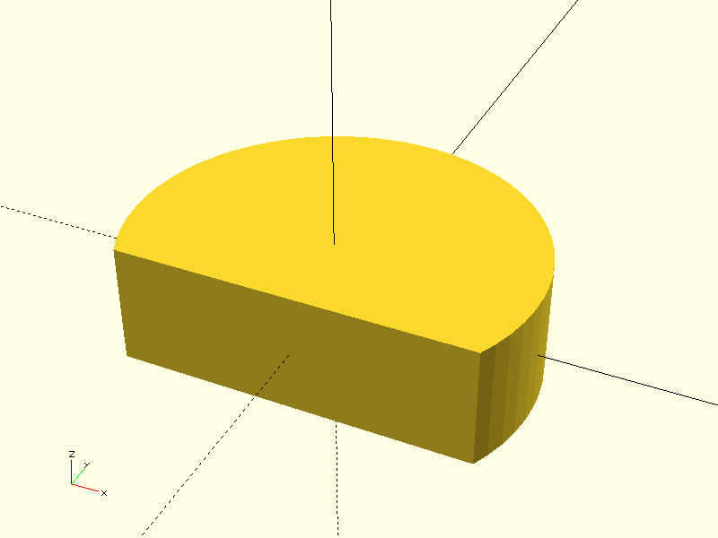

# Project CADGen

## Objective
Experiment Details :
> This project aims to generate a 3D model of woodruff key.
---

## Prompts
List the prompts or inputs used are:
1. "Write OpenSCAD code to model a Woodruff key. The key should be a half-cylinder with the following dimensions: width (diameter) = 10 mm and length = 25 mm. The flat side should be on the bottom, and the curved side on top, as it would be seated in a shaft slot. Use the cylinder() function to create a horizontal half-cylinder (rotated appropriately), and cut it in half using difference() and a cube."

2. "Generate a 3D model of a Woodruff key, size 4 × 13 (width 4 mm, diameter 13 mm), according to standard dimensions"
---

## Result

| Prompt | Time Taken | Attempt | Outcome | Error |
|--------|------------|--------|---------|-------|
| Prompt 1 | 21.9s | 1 |  | None |
| Prompt 2 | 27.2s | 1 |  | None |

---

### Notes
- **Time Taken**: Duration it took to complete the task.
- **Attempt**: Number of attempts made for that prompt.
- **Outcome**: Screenshot or visualization of the output.
- **Error**: Any error messages encountered during execution.

---

## Command
python3 main.py -ri -p "Prompt" -d "directory" -b "basename"
