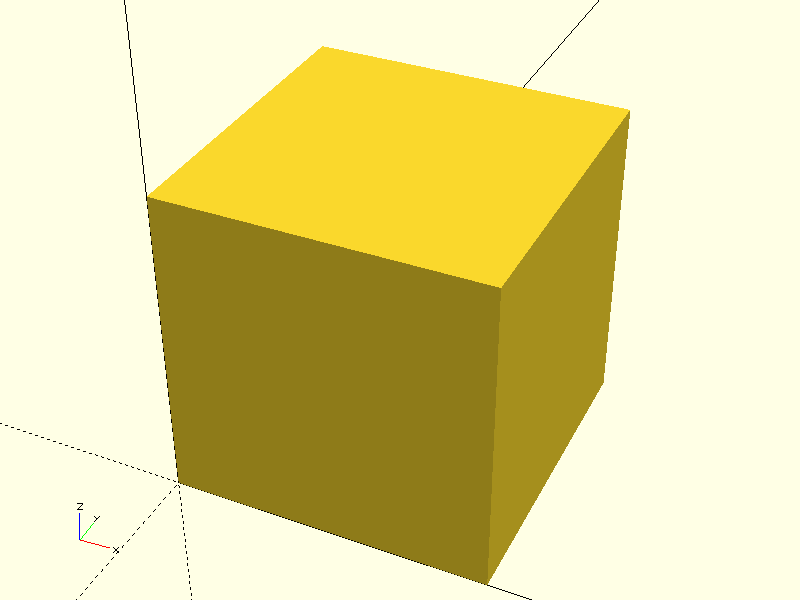

# CADGen: Automated 3D CAD Model Generation using LLMs

**Project Purpose:**  
CADGen leverages Large Language Models (LLMs) to automate the creation of 3D CAD models, specifically for mechanical engineering applications. It interprets natural language specifications to generate parametrically defined 3D models, streamlining design workflows and reducing manual drafting time.

---

## Table of Contents

1. [Introduction](#introduction)  
2. [Features](#features)  
3. [Motivation](#motivation)  
4. [Installation](#installation)  
5. [Usage](#usage)  
6. [How It Works](#how-it-works)  
7. [Examples](#examples)  
8. [Contributing](#contributing)  
9. [License](#license)  
10. [Acknowledgements](#acknowledgements)  
11. [Contact](#contact)  

---

## Introduction

CADGen is designed to automate 3D CAD modeling using the capabilities of LLMs. By converting textual descriptions into CAD instructions, engineers can rapidly prototype and iterate designs without manually creating models from scratch.

---

## Features

- **Natural Language to CAD**: Input design requirements in plain English.  
- **Parametric Modeling**: Support for adjustable dimensions and parameters.  
- **Automation in Mechanical Engineering**: Speeds up the design process.  
- **Multiple Export Formats**: Supports STL the common CAD file types.  
- **Extensible Architecture**: Easy to integrate new LLM models.

---

## Motivation

Creating CAD models manually is time-consuming and error-prone. CADGen aims to reduce repetitive tasks, improve design iteration speed, and make CAD modeling accessible to engineers who may not be CAD experts.

---

## Installation

1. Clone the repository:  
```bash
git clone https://github.com/asvera/CADGen.git
cd CADGen
```
2. Install required dependencies:
```bash
pip install -r requirements.txt
```
---

## Usage

```bash
python cadgen.py --promot "<PROMPT>" -b "<NAME_OF_FILE>"
```

* Generated CAD files will be saved in the `output/` folder.
* Use `--dir` option to save in directory 

---

## How It Works

1. **Input**: User provides textual specifications for the desired CAD model.
2. **LLM Processing**: The LLM interprets the input and generates CAD instructions or script code.
3. **CAD Generation**: Instructions are executed in the CAD engine to produce a 3D model.
4. **Output**: Users can preview, refine, and export the CAD model in various formats.

---

## Examples


*Figure 1: CAD model generated from textual specification.*

Additional examples can be found in the `examples/` folder.

---

## Contributing

We welcome contributions! You can:

* Report bugs
* Suggest new features
* Improve LLM integration
* Expand CAD format support

Please fork the repository and submit a pull request.

---

## License

This project is licensed under the GPLv3 License. See the [LICENSE](LICENSE) file for details.

---

## Acknowledgements

* LLM frameworks used for natural language processing
* Open-source CAD libraries and engines
<!-- * Mentors and colleagues supporting this project -->

---

## Contact

**GitHub:** [https://github.com/asvera](https://github.com/asvera)
